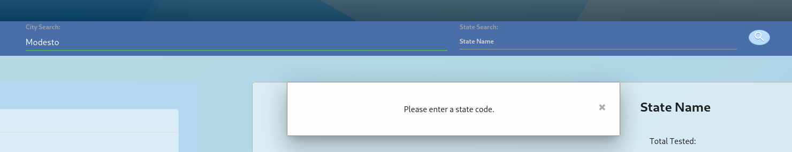

# COVID-19 Statistics 

## Description
Our project is a website designed for American domestic travelers interested in COVID-19 statistics, testing centers, and hospitals in the city/ state they are visiting. It was made possible with the integration of four APIs - one that provided the coordinates of a particular city, another that provided the case statistics for a particular state, another that provides local testing centers, and another the provided the local county health department contact information. Once a user inputs their desired city and state, total number of people in that area that were tested, positive, negative, and hospitalized as well as deaths are displayed. It also shows when the data from the API was last updated. Chart.js was then used to create a graphical representation of the historical data pulled from a COVID tracking API. The page also includes an "About Creators" page that includes a small biography of each collaborator as well as their LinkedIn and GitHub links. 

This page utilizes third party APIs (jQuery, Moment.js, Chart.js), server side APIs (Open Weather Map, Here Geocoding, Postman County Health Department, COVID Tracking), Materialize CSS framework, Google Fonts, Font Awesome Icons, and localStorage. 

## Table Of Contents
- [User Story](#User-Story)
- [Acceptance Criteria](#Acceptance-Criteria)
- [Access and Installation](#Access-and-Installation)
- [Usage](#Usage)
- [Features](#Features)
- [Authors](#Authors)
- [Credits](#Credits)

## User Story 
AS A local citizen of my city/county/state
I WANT to see the current COVID-19 statistics in my region
SO THAT I can make more informed decisions for myself and my family/friends

AS A concerned family member/friend
I WANT to see the current COVID-19 statistics in the region in which my family/friends live
SO THAT I can stay informed about their situation/well-being and feel more secure

AS A traveler
I WANT to see the current COVID-19 statistics in the region where I want to go
SO THAT I can make a safer decision about where or whetherto travel

## Acceptance Criteria
GIVEN I am looking for United States COVID-19 data
WHEN I search a city and its state
THEN COVID-19 statistics are displayed as well as nearby testing centers and my local county health department
WHEN I click on the graph button
THEN I can view a graphical representation of the historical COVID-19 data
WHEN I click the "About Creators" link
THEN I can view information about the creators and their LinkedIn and GitHub profiles

## Access and Installation

This project can be accessed either via the GitHub Repository page or the deployed public page. 

- [GitHub Repository](https://github.com/sophia2798/covid_stats)
- [Deployed Page](https://sophia2798.github.io/covid_stats/)
- [Google Presentation](https://docs.google.com/presentation/d/1Xn03BNl1wCgsR-uxLFY7SlKJH8KYhZ-yLmt8TF_IZLg/edit?usp=sharing)

To open and edit code files, you will need a text editor. The one used to create this page was Visual Studio Code (https://code.visualstudio.com/).

To install this repository, you can git clone the repository using the green "Code" button. You can copy and paste either the HTML or SSH URL.

## Usage

This page can be used to view the current COVID-19 statistics in the region of the user's choosing. Users may seek out this information in relation to their personal health/well-being or that of a loved one. Once the user inputs a city and state, they can view current COVID-19 statistics, local testing centers, and the contact information for the associated county health department. Their search history is also saved and can be clicked on to re-view that location's information.  

This project can also be used as a template to learn more about making API calls, retrieving and storing information in localStorage, dynamically creating HTML elements, and jQuery. In particular, this project also utilized API calls that depended on the output of another API call. Therefore, this project can be further used to study this kind of "nested" aspect of API calls. 

## Features

- A search section for city and state input. It includes a search button with an icon. 

    

- A section for the search history, with clickable cells

    

- A modal alert if the user (1) does not enter a city and does not enter a state (2) does not enter a city or does not enter a state (3) enters an invalid city/state combination.

    
    
    

- A section that displays the state's current case statistics including a button that opens a modal containing the graph.

    

- A modal that contains a Chart.js graph displaying historical state case data 

    

- A section showing the local testing centers

    

- A section showing the local county health department contact information including a working link to their website

    

- An "About Creators" page including short biographies and links to each creator's GitHub and LinkedIn

    

- Animated backgrounds for the body and the jumbotron (can be seen in the Demo gif)

## Authors

- Sophia Jung
    - [GitHub Profile](https://github.com/sophia2798)
    - [LinkedIn](https://www.linkedin.com/in/sophia-jung-7614991b5/)

- Zhouyi Wang 
    - [GitHub Profile](https://github.com/zhouyiartemiswang)
    - [LinkedIn](https://www.linkedin.com/in/zhouyi-wang-3a168076/)
- Larry Cessna 
    - [GitHub Profile](https://github.com/lbcessna)
    - [LinkedIn](https://www.linkedin.com/in/larry-cessna/)
- Wesley McMillan 
    - [GitHub Profile](https://github.com/wmcmillan)
    - [LinkedIn](https://www.linkedin.com/in/wesley-m-46157088/)
- UW Coding Bootcamp/Trinity Education Services

## Credits 

- [jQuery](https://developers.google.com/speed/libraries#jquery)

- [Open Weather Map API](https://openweathermap.org/api)

- [Google Fonts](https://fonts.google.com/)

- [Moment.js](https://momentjs.com/)

- [Postman County Health Department API](https://documenter.getpostman.com/view/8854915/SzYXVdyQ?version=latest)

- [Here Geocoding Testign Center API](https://developer.here.com/blog/finding-covid-19-testing-sites)

- [COVID Tracking API](https://covidtracking.com/data/api)

- [Materialize CSS](https://materializecss.com/getting-started.html)

- [Chart.js](https://www.chartjs.org/)

- [Font Awesome Icons](https://fontawesome.com/)